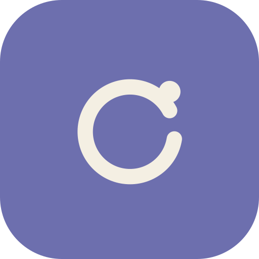
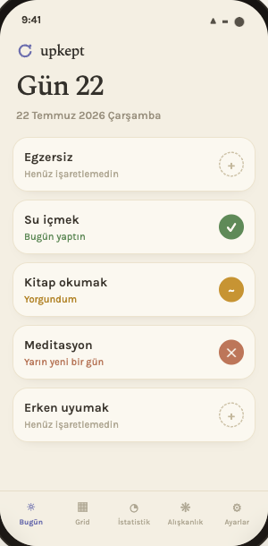
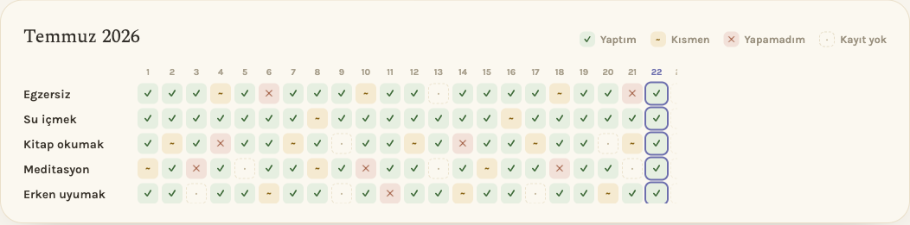

<div align="center">



# upkept

### Kusursuz değil, *sürekli* ol.

Sakin ve yargısız bir aylık alışkanlık takipçisi. Bir günü kaçırmak bir alarm değil — sadece sessizce, istersen bir sebeple kaydedilir. Çünkü önemli olan kusursuz bir seri değil, **geri dönmen.**

<br/>

**[🌐 Web'de aç](https://upkept.pages.dev/app)**  ·  **[⬇︎ macOS için indir](https://github.com/erenbekman/upkept/releases/latest/download/Upkept.dmg)**  ·  **[📱 App Store'dan indir](https://apps.apple.com/us/app/upkept/id6794236887)**


<br/>



</div>

---

## Neden upkept?

Çoğu alışkanlık uygulaması seni bir seriyi bozduğunda cezalandırır — kırmızı rakamlar, bildirimler, suçluluk. upkept'in fikri farklı:

> **Kaçırmak bir hata değil, veridir.**

Bir günü kaçırdığında sebebini bir dokunuşla bırakırsın (*yorgundum, seyahatteydim, vaktim olmadı…*). Zamanla bu küçük notlar bir örüntüye dönüşür — kendini yargılamadan tanırsın. Metrikler "kusursuzluk" değil **süreklilik yüzdesi** etrafında kurulu.

## Öne çıkanlar

- ✍️ **Üç sakin durum** — Yaptım · Kısmen · Yapamadım. "Kaçırdım + sebep" kaydetmek "yaptım" kadar hızlı.
- ▦ **Aylık grid** — bütün ayı tek bakışta gör; bugün vurgulu, gelecek günler sessiz.
- ◔ **Nazik istatistikler** — süreklilik yüzdesi, en sık kaçırma sebebin, alışkanlık başına güncel seri.
- 🌙 **Açık / koyu tema** — sıcak dijital kağıt estetiği.
- 🔒 **Gizlilik önce** — hesap yok, reklam yok, izleme yok. Verilerin cihazında kalır.
- ☁️ **Opsiyonel senkron** — istersen login'siz, anonim bir kodla cihazların arasında senkronla.
- 📴 **Offline** — uçakta, dağda, internetsiz her yerde çalışır.

<div align="center">

</div>

## İndir / kullan

| Platform | Nasıl |
|---|---|
| **Web / PWA** | [upkept.pages.dev](https://upkept.pages.dev/app) — tarayıcıda aç, "Ana ekrana ekle" ile kur |
| **macOS** | [Upkept.dmg indir](https://github.com/erenbekman/upkept/releases/latest/download/Upkept.dmg) → Applications'a sürükle · Apple onaylı olmadığı için ilk açılışta **Sistem Ayarları → Gizlilik ve Güvenlik → Yine de Aç** |
| **iOS** | [App Store'dan indir](https://apps.apple.com/us/app/upkept/id6794236887) — iPhone & iPad |
| **Windows / Android** | Yakında |

macOS uygulaması açılışta kendini otomatik günceller — yeni sürüm için tekrar indirmene gerek yok.

## Gizlilik

Veriler (alışkanlıklar, durumlar, notlar) cihazında **yerel SQLite**'ta tutulur. Zorunlu hesap, bulut ya da izleme yok. Cihazlar arası senkronu açarsan verin Cloudflare'de anonim bir koda göre saklanır — kimliğine bağlı değil, istediğin an durdurabilirsin. Ayrıntı: [Gizlilik Politikası](https://upkept.pages.dev/privacy).

---

<details>
<summary><b>Geliştiriciler için</b></summary>

Tek kod tabanı → web (PWA) · iOS/Android (Capacitor) · masaüstü (Tauri).
Nuxt 3 (SPA, `ssr: false`) · TypeScript · @capacitor-community/sqlite (web'de jeep-sqlite + sql.js, native'de gerçek SQLite) · @vite-pwa/nuxt.

```bash
npm install
npm run dev              # geliştirme
npm run generate         # web build → .output/public (Cloudflare Pages: output dir "dist")
npm run cap:sync         # generate + native'e kopyala
npx cap open ios         # Xcode
npx tauri build --bundles app   # masaüstü
scripts/release-desktop.sh 0.1.2 "notlar"   # imzalı desktop sürümü + auto-update
```

</details>

<div align="center">
<br/>
<i>Kaçırmak da yolculuğun bir parçası.</i>
</div>
